# CryptoWheel
## Description
This is a CLI tool that using some scripts from my cryptography class to encrypt and decrypt messages. It is a work in progress and will be updated (maybe) as I learn more about cryptography.

## Usage
Some screenshots of the tool in action:
* `start`:

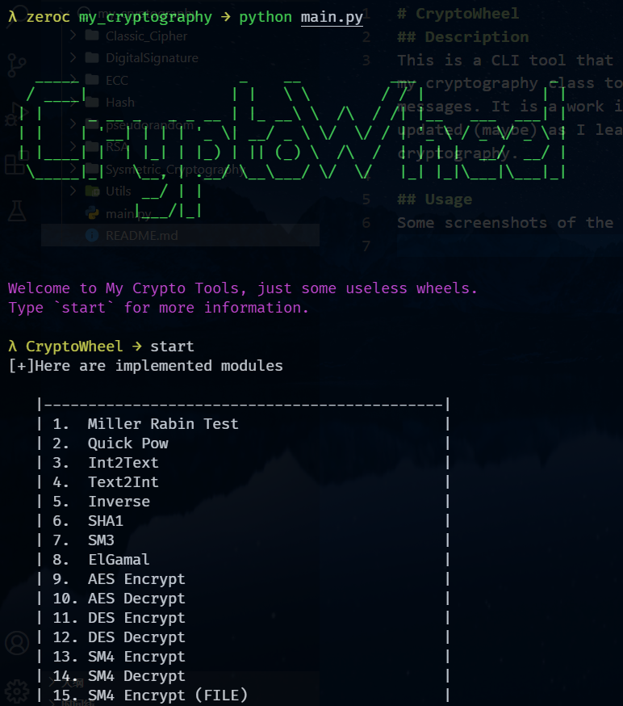
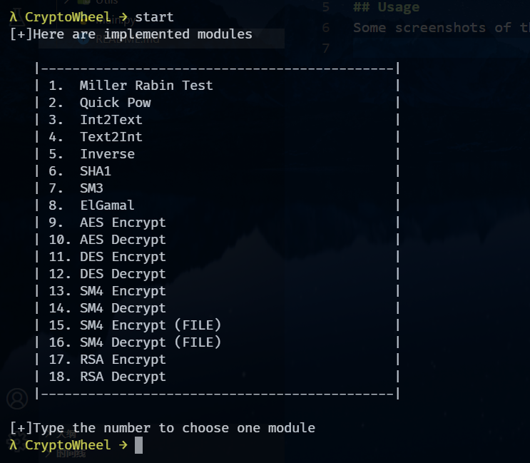
* `utils`:
  * `Miller Rabin Test`:
  
  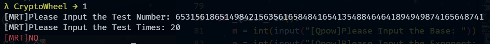
  * `Quick Power`:
  
  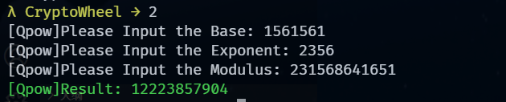
  * `Int2Text`:
  
  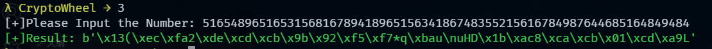
  * `Text2Int`:
  
  
  * `Inverse`:
  
  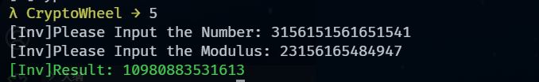
* `Hash`:
  * `SHA1`:
  
  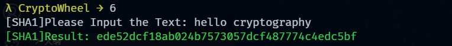
  * `SM3`:
  
  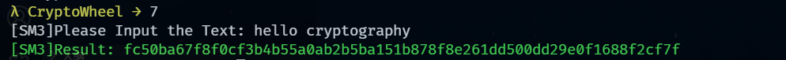
* `Digital Signature`:
  * `ElGamal Sign`:
  
  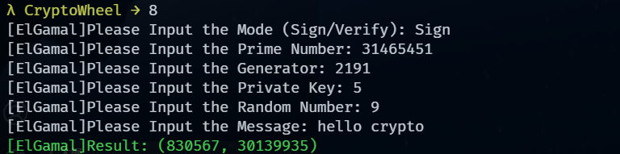
  * `ElGamal Verify`:
  
  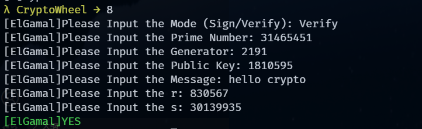
* `Sysmetric CryptoGraphy`:
  * `AES encrypt`:
  
  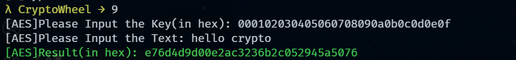
  * `AES decrypt`:
  
  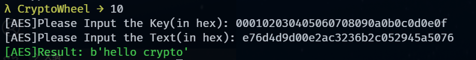
  * `DES encrypt`:
  
  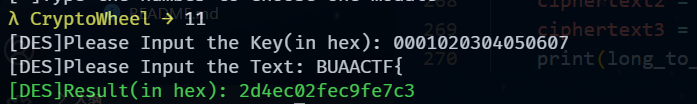
  * `DES decrypt`:
  
  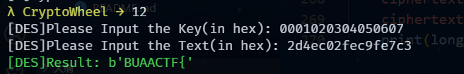
  * `SM4 encrypt`:
  
  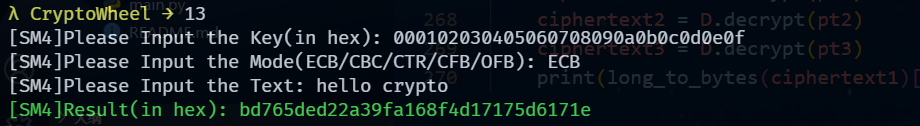
  * `SM4 decrypt`:
  
  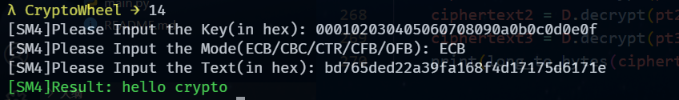
  * `SM4 encrypt file`:
  
  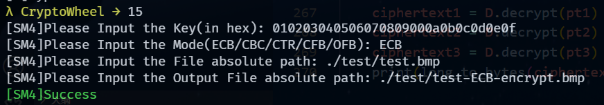
  * `SM4 decrypt file`:
  
  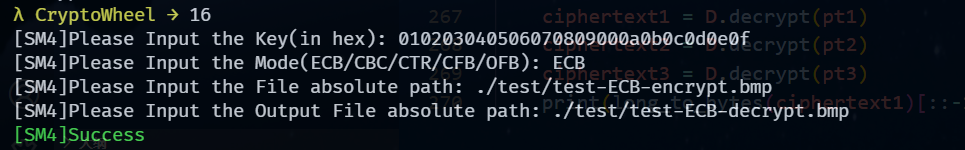
* `RSA`:
  * `Encrypt`:
  
  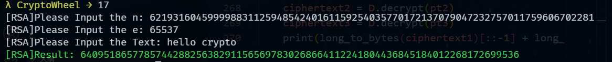
  * `Decrypt`:
  
  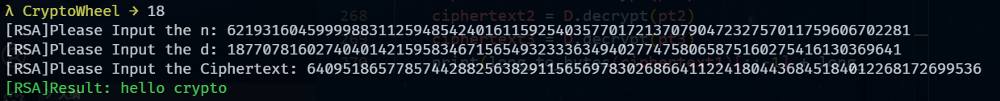